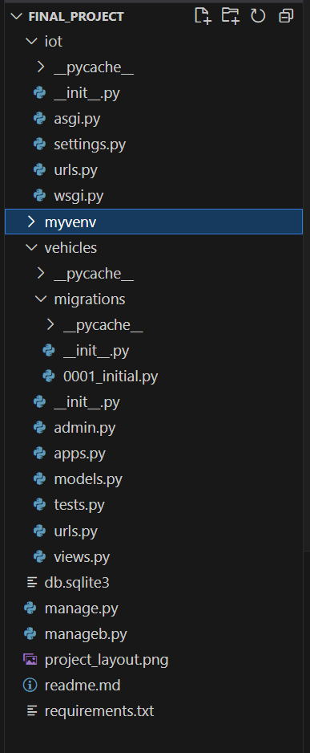
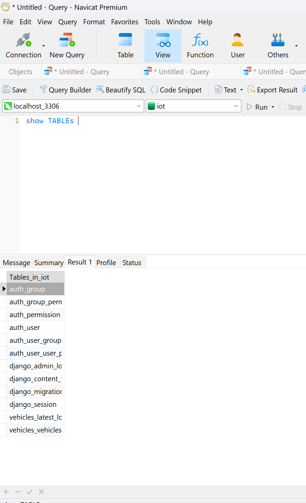
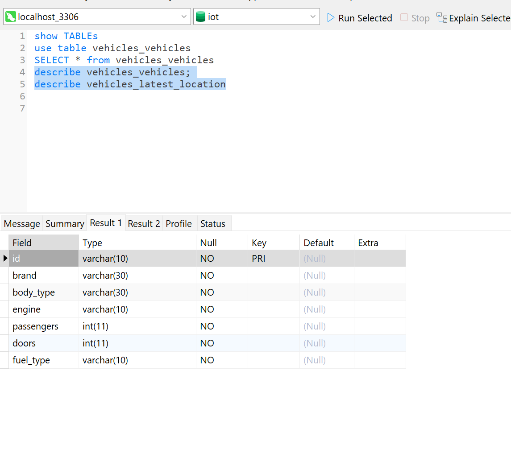
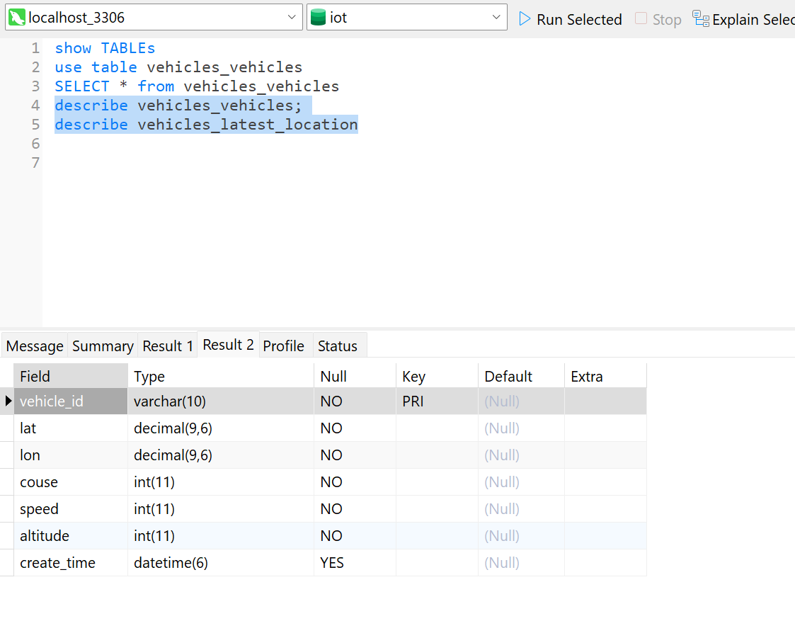
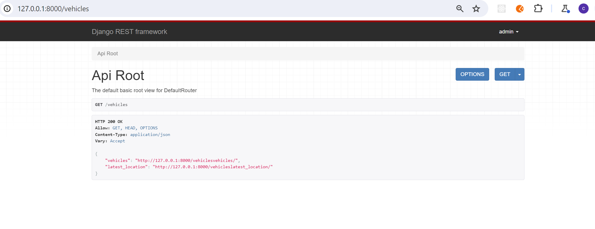
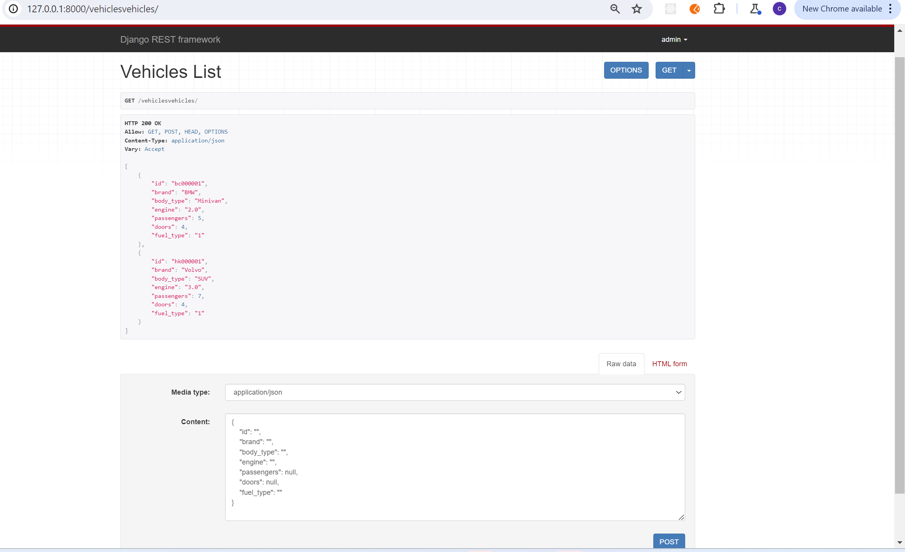

- [1 Project Report](#1-project-report)
  - [1.1 What i did for final project](#11-what-i-did-for-final-project)
  - [1.2 table comments](#12-table-comments)
  - [1.3 skills and knowledge](#13-skills-and-knowledge)
- [2 code steps](#2-code-steps)
  - [2.1 Django Project Setup](#21-django-project-setup)
  - [2.2 Setup Django connection with Mysql](#22-setup-django-connection-with-mysql)
  - [2.3 REST framework](#23-rest-framework)
  - [2.4 Test\&Result](#24-testresult)

<div STYLE="page-break-after:alway;"></div>


# 1 Project Report

## 1.1 What i did for final project
    15 years ago,I build a IOT system for traceing the location of vehicles.
    work and data flow like this:
    IOT devices of the vehicle get the location by GPS module and send the data to TCP server by GPRS/2/3/4G
    Back-end part store and analyse the data and front-end show the datas to users .

    Now i just get the data of two tables from Mysql and prepare data for front-end coders by Django REST framword.
## 1.2 table comments
```py
class Vehicles(models.Model):
    id = models.CharField(primary_key=True,max_length=10) #every vehicles have a unique id.
    brand = models.CharField(max_length=30)
    body_type = models.CharField(max_length=30)
    engine = models.CharField(max_length=10)
    passengers = models.IntegerField()
    doors = models.IntegerField()
    fuel_type = models.CharField(max_length=10)
    
    # class Meta:
    #     db_table = 'Vehicles'

class Latest_location(models.Model):
    vehicle_id = models.CharField(primary_key=True,max_length=10) 
    lat = models.DecimalField(max_digits=9,decimal_places=6) # latitude of the vehicle
    lon = models.DecimalField(max_digits=9,decimal_places=6) # longitude of the vehicle
    couse = models.IntegerField() #course 0 for north ; 90 for east; 180 for south
    speed = models.IntegerField() #0.1km 800 for 80 km
    altitude = models.IntegerField() # altitude of the vehicle
    create_time = models.DateTimeField(null=True) # the GPS date of the IOT devices when get the data.

```
## 1.3 skills and knowledge
    python 
    Django
    Django REST framwork
    Mysql
    Mysqlclient (pip)
    json
    markdown
    vscode


   
# 2 code steps

## 2.1 Django Project Setup
```python
# Create the directory for the project
mkdir final_project
cd final_project

# Create venv 
py -m venv myvenv
myvenv\Scripts\activate
# on Mac use `source myvenv/bin/activate

# Install Django and REST framework into myvenv
pip install django
pip install djangorestframework

# set up new project
django-admin startproject iot .
django-admin startapp vehicles
```
project layout


## 2.2 Setup Django connection with Mysql
```
pip install mysqlclinet
```
setting.py
```
DATABASES = {
    'default':{
        'ENGINE': 'django.db.backends.mysql',
        'NAME': 'iot',
        'USER': 'root',
        'PASSWORD': '',
        'HOST': 'localhost',
        'PORT': '3306'
    
    }
}
```python
makemigrations
```
py manage.py makemigrations
py manage.py migrate
```
models.py
```py
from django.db import models

# Create your models here.
class Vehicles(models.Model):
    id = models.CharField(primary_key=True,max_length=10)
    brand = models.CharField(max_length=30)
    body_type = models.CharField(max_length=30)
    engine = models.CharField(max_length=10)
    passengers = models.IntegerField()
    doors = models.IntegerField()
    fuel_type = models.CharField(max_length=10)
    
    # class Meta:
    #     db_table = 'Vehicles'

class latest_location(models.Model):
    vehicle_id = models.CharField(primary_key=True,max_length=10)
    lat = models.DecimalField(max_digits=9,decimal_places=6)
    lon = models.DecimalField(max_digits=9,decimal_places=6)
    couse = models.IntegerField()
    speed = models.IntegerField()
    altitude = models.IntegerField()
    create_time = models.DateTimeField(null=True)
```

iot/urls.py
```python
from django.contrib import admin
from django.urls import path,include 

urlpatterns = [
    path('admin/', admin.site.urls),
    path('vehicles',include('vehicles.urls')), # rout to vehicles.urls
]
```

vehicles/urls.py
```python
from django.contrib import admin
from django.urls import path,include
from . import views

urlpatterns = [
    path('admin/', admin.site.urls),
    path('', views.index),
]
```
views.py
```python
from django.shortcuts import render
from django.http import HttpResponse

# Create your views here.
def index(request) :
    return HttpResponse('vehicels')
```
makemigrations
```
py manage.py makemigrations
py manage.py migrate
```
tables created




insert datas to tables
```mysql
INSERT vehicles_vehicles VALUES('bc000001','BMW','Minivan','2.0',5,4,1)
INSERT vehicles_vehicles VALUES('hk000001','Volvo','SUV','3.0',7,4,1)

INSERT vehicles_latest_location VALUES('bc000001',49.16666,-123.11223,90,80,120,now())
INSERT vehicles_latest_location VALUES('hk000001',22.12222,113.11333,90,80,10,now())
```
 select data from tables
 ```mysql
SELECT * from vehicles_vehicles
select * from vehicles_latest_location
```


create superuser
```py manage.py createsuperuser --username admin
   Email address: chanchiuxyz@gmail.com
   password:XXXX
```

## 2.3 REST framework
Serializers\
vehicles/serializes.py
```python
from rest_framework import serializers
from .models import Vehicles,Latest_location


class VehicleSerializer(serializers.HyperlinkedModelSerializer):
    class Meta:
        model = Vehicles
        fields = ['id','brand','body_type','engine','passengers','doors','fuel_type']

class Lastest_locationSerializer(serializers.HyperlinkedModelSerializer):
    class Meta:
        model = Latest_location
        fields = ['vehicle_id','lat','lon','couse','speed','altitude','create_time']


```

Views\
vehicles/views.py
```python
from django.shortcuts import render
from django.http import HttpResponse
#REST framework
from rest_framework import permissions,viewsets
from .models import Vehicles,Latest_location
from vehicles.serializers import VehicleSerializer,Lastest_locationSerializer

# Create your views here.
def index(request) :
    return HttpResponse('vehicels pages')


class VehiclesViewSet(viewsets.ModelViewSet):
    queryset = Vehicles.objects.all()
    serializer_class = VehicleSerializer
    permission_classes = [permissions.IsAuthenticated]

class Latest_locationViewSet(viewsets.ModelViewSet):
    queryset = Latest_location.objects.all().order_by('create_time')
    serializer_class = Lastest_locationSerializer
    permission_classes = [permissions.IsAuthenticated]
```

URLs\
vehicles/urls.py
```py
from django.contrib import admin
from django.urls import path,include
from . import views

from rest_framework import routers

router = routers.DefaultRouter()
router.register(r'vehicles',views.VehiclesViewSet)
router.register(r'latest_location',views.Latest_locationViewSet)

urlpatterns = [
    path('admin/', admin.site.urls),
    path('', include(router.urls)),
    path('api/',include('rest_framework.urls',namespace='rest_framework'))
]

urlpatterns += router.urls
```
## 2.4 Test&Result




